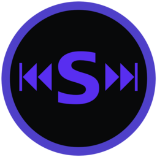
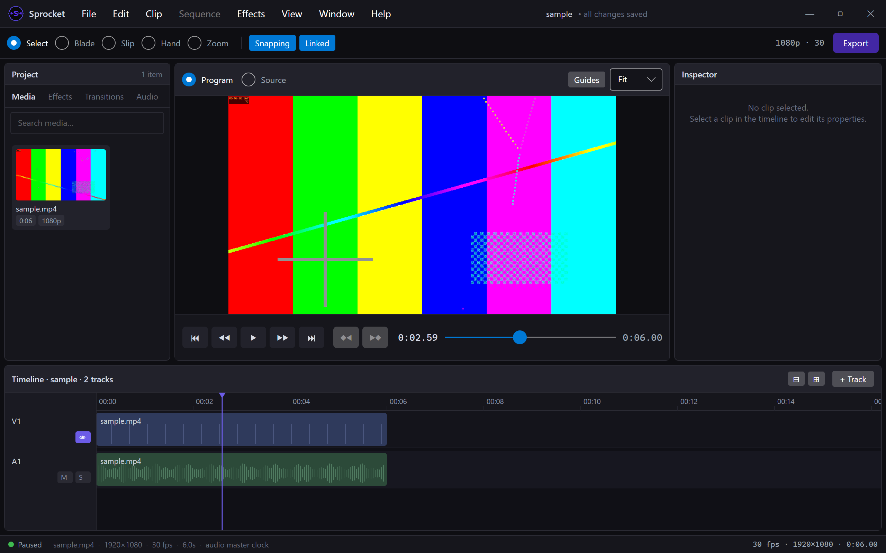

# Sprocket

**A cross-platform, non-destructive video editor — free and open source.**

<br clear="left" />

[](https://github.com/SprocketVideo/Sprocket/actions/workflows/ci.yml)
[](https://github.com/SprocketVideo/Sprocket/releases)
[](https://github.com/SprocketVideo/Sprocket/releases)
[](#platform-support)
[](https://dotnet.microsoft.com)

**Website:** <https://sprocketvideo.org> · **Download:** [latest release](https://github.com/SprocketVideo/Sprocket/releases/latest) ([install instructions](#installing-sprocket))

Sprocket runs on Windows 11, Linux, and macOS from a single managed codebase. It pairs a pure-data
timeline model with GPU compositing (SkiaSharp) and library-level FFmpeg decode/encode, so C# acts
purely as an orchestrator while the pixel-heavy work happens on the GPU and in native code — decoded
frames never touch the managed heap per frame.



> **Project status — alpha, packaged for testing.** The editor is a full panelled NLE with its
> feature build-out essentially complete: multi-track editing with professional trim tools, GPU
> effects / keyframing / color grading, generators & transitions, proxy media & render caching, a
> full export pipeline, and AI control over MCP. Per-OS packaging ships today — a Windows
> installer, a Linux AppImage, and a macOS `.app`, all with in-app auto-update — built by a CI
> matrix on every release tag. What remains is code-signing/notarization and native plugin hosting
> (VST3/AU, OpenColorIO/OFX) — see the [Roadmap](#roadmap). The guiding documents are authoritative: [BRIEF.md](BRIEF.md) (the *what*),
> [ARCHITECTURE.md](ARCHITECTURE.md) (the *how/why*), [PLAN.md](PLAN.md) (the build order with
> per-step status), and [FEATURES.md](FEATURES.md) (the canonical user-facing feature inventory).

---

## Features

### Working today

- **Non-destructive editing** — edits change a clip's in/out points, position, and effect stack;
  source media is never rewritten.
- **Full editing toolset** — multi-track timeline (filmstrips, waveforms, snapping, zoom) with
  Select / Blade / Slip / Hand / Zoom tools, ripple & roll trims, linked A/V, markers,
  constant-speed retime, freeze frames & stop-motion frame edits (frame hold, duplicate/remove
  frame), nested sequences, and multicam.
- **Image sequences & stills** — import a folder of numbered frames as one clip at a chosen frame
  rate (the stop-motion / time-lapse on-ramp) or a single still with a default duration, plus
  Interpret Footage to reassign a source's frame rate.
- **First-class undo/redo** — every model mutation (including AI edits) routes through an
  inverse-command stack, with gesture coalescing and an edit-history surface.
- **GPU effects & keyframing** — brightness, color, and geometric transform as SkSL shaders that
  compose identically on preview and export; animate any effect parameter with keyframe lanes and
  an editable velocity graph.
- **Color grading** — white balance, color wheels, curves, and an HSL qualifier, plus DJI
  D-Log / D-Log M input transforms applied as GPU LUTs.
- **Generators, titles, adjustment layers & transitions** — title/text generator clips (including
  scrolling titles), adjustment layers whose effect stacks apply to everything beneath, and a
  transition library with overlapping-clip resolution.
- **Audio** — sample-accurate mixer with per-clip gain envelopes, per-track gain/pan/mute/solo,
  built-in audio effects on insert chains at clip / track / bus / master scope, loudness metering &
  normalization, and a master limiter. **Audio is the master clock** for A/V sync.
- **Performance** — proxy media (edit low-res, export from originals), a timeline render cache,
  hardware-accelerated decode (D3D11VA / CUDA / QSV, VAAPI, VideoToolbox) with software fallback,
  and premultiplied-alpha compositing of alpha-channel media.
- **Export & delivery** — a format matrix beyond H.264/AAC MP4, audio-only export (WAV/FLAC/MP3/
  AAC/Opus), export presets, an export queue with burn-ins & handles, hardware encoders, and
  EDL/SMPTE interchange — all through the *same* render graph that drives preview.
- **Projects** — versioned JSON save/load with relative + absolute media paths, autosave + crash
  recovery, media relinking, and offline-media tolerance.
- **AI control & scripting** — an opt-in, loopback-only MCP server (~65 tools) lets AI assistants
  edit the timeline — undoably, through the same command stack — plus headless CLI flags for
  diagnostics and scripting.

The full per-feature inventory lives in [FEATURES.md](FEATURES.md); per-step build status in
[PLAN.md](PLAN.md).

### Planned

Code-signing & notarization (alpha artifacts are unsigned) · native plugin hosting — VST3/AU audio
and OpenColorIO/OFX (the managed plugin host and built-in effects ship today) · variable/ramped
speed & reverse retime (freeze frames ship today) · convolution reverb (Studio Reverb, Shimmer
Reverb, and audio freeze ship today). See the [Roadmap](#roadmap).

---

## Installing Sprocket

Grab the [latest release](https://github.com/SprocketVideo/Sprocket/releases/latest). Every
download is self-contained (no .NET or FFmpeg install needed), and the installed forms update
themselves in-app. The alpha builds are **not code-signed yet**, so each OS shows a one-time
warning — the release notes on every release walk through it.

- **Windows** — run `Sprocket-win-x64-Setup.exe` (SmartScreen: *More info → Run anyway*).
- **Linux** — `chmod +x Sprocket-linux-x64.AppImage && ./Sprocket-linux-x64.AppImage`.
- **macOS** — unzip `Sprocket-osx-arm64-Portable.zip` (Apple Silicon) or `…-osx-x64-…` (Intel),
  drag `Sprocket.app` to Applications, then right-click ▸ Open (or System Settings ▸ Privacy &
  Security ▸ *Open Anyway*).
- Portable per-RID zips are also attached for every platform (no self-update).

---

## Platform support

| OS | Runtime IDs | Status |
|---|---|---|
| **Windows 11** | `win-x64`, `win-arm64` | Primary development platform; installer + portable zip; FFmpeg 8 natives bundled. |
| **Linux** | `linux-x64`, `linux-arm64` | Render path verified byte-identical to Windows (headless); AppImage (`x64`) + portable zips. |
| **macOS** | `osx-x64`, `osx-arm64` | Same managed code; `.app` bundle per arch, built on macOS CI runners with FFmpeg 8 bundled (unsigned during the alpha). |

The managed assemblies are identical on every OS — only the bundled native libraries differ per RID.
Sprocket bundles its **own FFmpeg 8** libraries rather than depending on a system install (distro
FFmpeg versions vary and are often ABI-incompatible). Sprocket talks to FFmpeg through its **own
hand-rolled P/Invoke binding** (no FFmpeg binding or runtime NuGet), so the natives for **every** RID —
Windows included — are fetched and bundled by the release script (see
[Creating a release](#creating-a-release)).

---

## Building from source

### Prerequisites

- **.NET 10 SDK**
- **`ffmpeg` CLI on `PATH`** — required only to run the media/audio *tests* (they generate a
  deterministic fixture clip once). Not needed to build or run the editor.

### Build, test, run

```bash
# Build the whole solution
dotnet build Sprocket.slnx

# Run all tests (xUnit)
dotnet test Sprocket.slnx

# Run one test project, or a single test by name
dotnet test tests/Sprocket.Core.Tests/Sprocket.Core.Tests.csproj
dotnet test tests/Sprocket.Core.Tests/Sprocket.Core.Tests.csproj --filter "FullyQualifiedName~TimingTests"

# Run the editor (optional first arg = a media file; otherwise a sample clip is generated)
dotnet run --project src/Sprocket.App [path/to/media.mp4]
```

### Cross-platform verification (Linux, headless)

The repo ships two Docker-based checks that need only Docker installed:

```bash
# Decode → SkSL shader → offscreen PNG, proving the media + Skia stack works on Linux
bash scripts/linux-check.sh

# Run a published linux-x64 release bundle on a clean machine and confirm the bundled
# FFmpeg libraries actually load (see "Creating a release" for the publish step first)
docker run --rm -v "$PWD:/repo" -e HOME=/root \
  mcr.microsoft.com/dotnet/runtime-deps:10.0 bash /repo/scripts/linux-smoke.sh
```

---

## Creating a release

Releases are cut with [`scripts/gh-release.ps1`](scripts/gh-release.ps1): it bumps the version,
commits, tags `v<version>-alpha.N`, and pushes — the tag triggers
[`.github/workflows/release.yml`](.github/workflows/release.yml), which builds every RID on its
native OS runner (the only way to produce the macOS `.app`), smoke-tests each artifact headlessly
(`--version` / `--ffmpeg-check` / `--audio-check`, plus a real silent install on Windows), and
publishes the GitHub release with everything attached.

```powershell
# Bump patch, tag v<ver>-alpha.1, push, watch CI build + publish the release
pwsh scripts/gh-release.ps1

# Preview all steps without touching git/GitHub
pwsh scripts/gh-release.ps1 -DryRun
```

[`scripts/release.ps1`](scripts/release.ps1) (PowerShell, cross-platform) remains the underlying
build engine, usable locally: it publishes the editor as a self-contained **folder** per runtime,
bundles the FFmpeg 8 + OpenAL Soft natives next to the exe, and produces portable zips and/or
Velopack packages (Windows `Setup.exe`, Linux AppImage, macOS `.app` — with full/delta auto-update
feeds).

```powershell
# Build + zip the full RID matrix into ./dist
pwsh scripts/release.ps1

# One runtime, with the Velopack installer/auto-update packages too (needs `vpk` on PATH:
# dotnet tool install -g vpk --version <pinned in release.ps1>)
pwsh scripts/release.ps1 -Rids win-x64 -Package velopack,zip

# Quick local iteration: keep the publish folder, skip R2R
pwsh scripts/release.ps1 -Rids win-x64 -NoZip -NoReadyToRun
```

| Flag | Purpose |
|---|---|
| `-Rids <list>` | RIDs to build (default: `win-x64 win-arm64 linux-x64 linux-arm64 osx-x64 osx-arm64`). |
| `-Package <list>` | Artifact kinds per RID: `zip` (default) and/or `velopack`. |
| `-Version <v>` | Exact version to publish (default: bump the patch in `Directory.Build.props`). |
| `-VersionSuffix <s>` | Prerelease suffix (e.g. `alpha.1`) stamped into the build + artifact names. |
| `-Configuration` | Build configuration (default `Release`). |
| `-OutDir <dir>` | Output directory (default `dist`). |
| `-NoBump` | Publish the current version without bumping. |
| `-NoZip` | Leave the raw publish folders instead of zipping. |
| `-NoClean` | Don't wipe `dist/` first (CI accumulates multiple invocations). |
| `-NoFFmpeg` | Publish only; skip FFmpeg native bundling. |
| `-NoReadyToRun` | Skip ReadyToRun AOT precompile — faster, smaller build; slower cold start. |
| `-OsxX64FFmpegUrl` / `-OsxArm64FFmpegUrl` | Override archive URL of FFmpeg 8 macOS `.dylib`s. |

**How FFmpeg natives are sourced per RID:** Sprocket uses its own hand-rolled binding, so there is no
FFmpeg runtime NuGet for any platform — every RID's natives are fetched and bundled by this script.

- **win-x64 / win-arm64 / linux-x64 / linux-arm64** — downloaded from
  [BtbN FFmpeg-Builds](https://github.com/BtbN/FFmpeg-Builds) (`*-gpl-shared`, FFmpeg 8) and copied
  next to the executable.
- **osx-x64 / osx-arm64** — BtbN publishes no macOS builds, so on a macOS host the script bundles
  **Homebrew's FFmpeg 8** via [`scripts/macos-bundle-ffmpeg.sh`](scripts/macos-bundle-ffmpeg.sh):
  the full transitive dylib closure is copied next to the executable, every install name is
  rewritten to `@loader_path`, each dylib is re-signed ad-hoc, and libavcodec major 62 is
  hard-asserted — self-contained with no Homebrew and no `DYLD_*` at runtime. A
  `-Osx*FFmpegUrl` archive overrides that source.

### macOS local development

When running from source locally on macOS (not from a packaged release), install FFmpeg 8 with
Homebrew and point Sprocket at its `lib` directory:

```bash
brew install ffmpeg@8
export SPROCKET_FFMPEG8_DIR="$(brew --prefix ffmpeg@8)/lib"
dotnet run --project src/Sprocket.App
```

`SPROCKET_FFMPEG8_DIR` must point at the directory containing `libavcodec.62.dylib`,
`libavformat.62.dylib`, `libavutil.60.dylib`, `libswscale.9.dylib`, and `libswresample.6.dylib`.
Packaged macOS releases bundle FFmpeg inside the `.app` — no setup needed there.

> **Verifying a release end-to-end.** The app sets no FFmpeg `RootPath`, so natives resolve from the
> application directory — and the bundled libraries depend on one another. Sprocket pre-loads them in
> dependency order at startup so a "drop the files beside the exe" bundle loads with no
> `LD_LIBRARY_PATH`. To prove a Linux bundle actually loads, publish it and run the smoke test:
>
> ```powershell
> pwsh scripts/release.ps1 -Rids linux-x64 -NoZip
> ```
> ```bash
> docker run --rm -v "$PWD:/repo" -e HOME=/root \
>   mcr.microsoft.com/dotnet/runtime-deps:10.0 bash /repo/scripts/linux-smoke.sh
> ```
>
> The app exposes a headless `--ffmpeg-check` flag that loads FFmpeg and exits; the smoke test runs
> it with `LD_LIBRARY_PATH` unset and expects `RESULT: PASS`.

---

## Architecture at a glance

Projects follow a strict, acyclic dependency direction. `Sprocket.Core` is the keystone and depends
on nothing — no UI, no native code.

```
Sprocket.App ──► Sprocket.Playback ──► Sprocket.Render ──► Sprocket.Core
     │              │      │              │
     │              │      └──► Sprocket.Audio ──► Sprocket.Core
     │              └──► Sprocket.Media ──────────► Sprocket.Core
     └──► (Persistence, Export) ──► Sprocket.Core
```

- **`Sprocket.Core`** — the pure-data timeline model (`Project → Timeline → Track[] → Clip`), the
  render graph (a pure function of project + time, so the same graph serves preview *and* export),
  the command stack, the tick-based time model, and the seam interfaces everyone else implements.
- **`Sprocket.Media`** — FFmpeg interop (decode, seek, resample, hardware decode, encode). Pixels
  stay in native buffers; no SkiaSharp or UI here.
- **`Sprocket.Audio`** — the mixer and the master clock (depends only on Core, not Media).
- **`Sprocket.Render`** — SkiaSharp GPU compositing and SkSL effect shaders.
- **`Sprocket.Playback`** — the clock-driven pump that keeps video in sync with the audio clock.
- **`Sprocket.Export`** — offline render-to-file over the same render graph.
- **`Sprocket.Persistence`** — versioned JSON save/load.
- **`Sprocket.App`** — the Avalonia UI shell and composition root.

Key design facts: time is `long` ticks at 240,000/sec (exact for 48 kHz audio and common + NTSC
frame rates — never `double` seconds); audio is the master clock; new features land on existing
seams rather than rewrites. See [ARCHITECTURE.md](ARCHITECTURE.md) for the full design (referenced
throughout the code as `§N`).

**Technology stack:** Avalonia UI 12 · SkiaSharp 3.119.4 (pinned to match Avalonia's transitive
Skia) · FFmpeg 8 via a hand-rolled `[LibraryImport]` binding · Silk.NET.OpenAL. All native interop is
P/Invoke against a C ABI — there is no C++/CLI — so one managed build serves all three OSes.

---

## Roadmap

The vertical slice (steps 1–9) and the feature build-out are complete — proxy media, generators &
adjustment layers, alpha compositing, transitions, the export pipeline (presets, queue, burn-ins,
hardware encoders), the render cache, the color-grading suite, D-Log, and the MCP server all ship
today. Remaining work (full detail and per-step status in [PLAN.md](PLAN.md)):

- **Code-signing & notarization** — packaging itself ships today (Windows installer, Linux
  AppImage, macOS `.app`, auto-update, CI matrix builds with per-artifact smoke tests); the alpha
  artifacts are unsigned, so Windows signing and macOS notarization remain.
- **Native plugin & color hosting** — VST3/AU audio plugins and OpenColorIO / OFX. The managed
  plugin host (collectible `AssemblyLoadContext`) and the built-in managed effects ship today.
- **Advanced retime** — variable/ramped speed and reverse (constant-speed retime, freeze frames,
  and stop-motion frame edits ship today).
- **Audio extras** — convolution reverb (the Studio Reverb, the Shimmer Reverb, factory presets,
  the delay family — digital / tape / multi-tap / stereo ping-pong — the noise gate, the shelving
  EQ, and clip-audio freeze ship today).

---

## License

[MIT](LICENSE) © 2026 D'Arcy Rittich.

FFmpeg is bundled separately per platform as a **GPL-configured build** (it provides the x264/x265
export encoders); Sprocket's MIT license is GPL-compatible, and the corresponding FFmpeg source is
linked from [THIRD-PARTY-NOTICES.md](THIRD-PARTY-NOTICES.md) (also shipped in-app under
Help ▸ Third-Party Notices).
